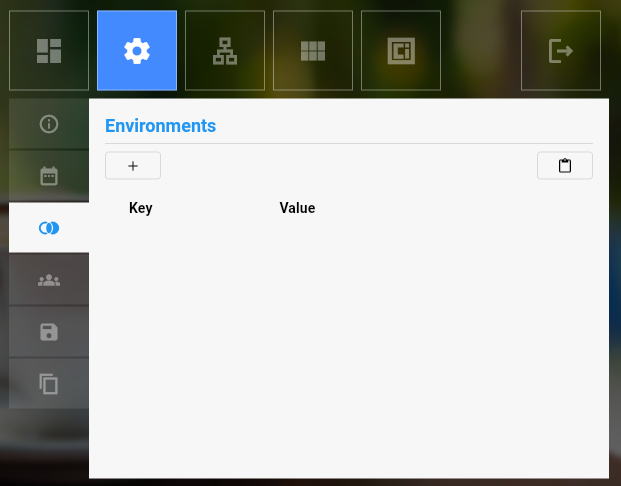
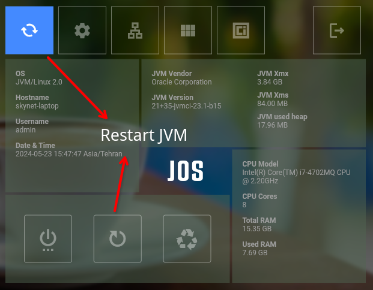

## Http Server Module
Before start this module , please add this environment variables :     

| key              | value   |   
|------------------|---------|    
| HTTP_SERVER_HOST | 0.0.0.0 |
| HTTP_SERVER_PORT | 8080    |

Open JOS panel then :      
`settings` > `environments`  
Click on `+` button and add new environment.    
      
after add environments jvm should be restarted.   
please follow animations.    
      

