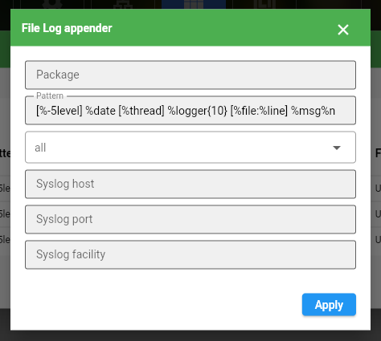

# Sample JOS Modules 

### this repository contain simple jos modules based on :
* Java pure 
* Tomcat
* Jetty
* ActiveMQ
* Micronaut Framework 
* ...

**Note :** _These modules tested with Java 21._ 

### Generate `jpkg` archive 
All jos modules should be archived with `jpkg` format .
this archive is based on the same zip archive , with the different that has a additional file named `manifest.yaml` inside that .  
this file help JOS to get information's of module.
[Please read `maven-jpkg` document](https://github.com/Java-OS/maven-jpkg)

compile module :  
```shell
cd 01-basic # choose module 
mvn clean compile package jpkg:archive
# jpkg should be generated : 
ls ./target/jos-module/01-basic-0.1.jpkg
```

### Manage Modules:
Open JOS web panel `http://w.x.y.z:7080` and go to modules tab , click on `+` button and choose `jpkg` archive.


### Manage Logs: 
Click on log management button then config your log appender.    
**Note :** currently jos support `file` and `syslog` appender.    
**Note :** You can runtime change log level without restart module.        

#### File Appender

now click on `+` to add new log appender base on your favorite configuration.    
   
click on love stream button if you want to verify pattern or levels.    

#### Syslog Appender
Go to syslog tab.

Click on `+` to add new syslog appender.    



